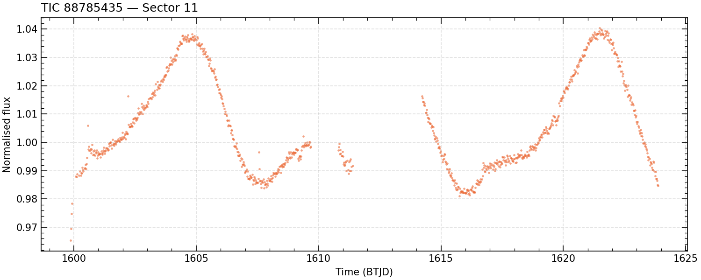

# tessquicklook

Python port of an IDL TESS quick-look light-curve pipeline
(`quicklooktessffi.pro`, `quicklooksector3.pro`, and their ~15 dependencies).

The pipeline removes instrumental systematics by fitting them **simultaneously**
with the stellar variability, rather than flattening first. That is what keeps
it unbiased for rapidly-rotating young stars, where PDCSAP's pre-flattening
distorts real astrophysical signal.

It runs on either data source, with the same correction:

* **SPOC short cadence** — 20 s or 120 s mission light curves. Photometry comes
  from `SAP_FLUX` as delivered; dilution from the `CROWDSAP` keyword.
* **FFIs** — 30 min / 10 min / 200 s. Does its own photometry from a TESScut
  cutout, with aperture selection and a PRF scene model for dilution.

## Install

```bash
pip install git+https://github.com/awmann/tessquicklook.git
```

or, to work on it:

```bash
git clone https://github.com/awmann/tessquicklook.git
cd tessquicklook
pip install -e .
```

Dependencies: numpy, scipy, astropy, astroquery, lightkurve, tess-point,
matplotlib. Python ≥ 3.9.

## Quickstart

```python
from tessquicklook import quicklooktess

result = quicklooktess(166527623, outfile="lc.csv")

t    = result["t"]         # BTJD
flux = result["fcor"]      # systematics removed, stellar variability retained
cad  = result["cadence_s"] # which cadence each point came from
```

`quicklooktess` picks the fastest data available **in each sector**: 20 s SPOC
if the target was on the fast-cadence list, else 120 s SPOC, else FFI
photometry. That resolution matters — HIP 67522 above has 120 s data in Sectors
11 and 38 but 20 s data in 64, 101 and 102, and a per-target choice would throw
away one or the other.

See [Choosing a cadence](#choosing-a-cadence) to override it.

A complete runnable version is in [`examples/minimal_example.py`](examples/minimal_example.py):

```bash
python examples/minimal_example.py
```

TIC 88785435 was never on a SPOC target list, so there is nothing faster than
the FFIs and the call falls back to FFI photometry — which makes it a good first
example, because it exercises the whole photometry path. It prints

```
Cadence plan for TIC 88785435 -- FFI: [11]

TIC 88785435: RA=224.283981 Dec=-30.879913 Tmag=11.728
tess-point predicts 3 sectors
Processing Sector 11 (camera 1, ccd 3) ...
  dilution: target contributes 0.319-0.958 of aperture flux
  aperture: circular #3, scatter 918 ppm, 942 cadences

942 cadences over 24.0 days
aperture chosen: circular #3
point-to-point scatter: 918 ppm
variability retained:   16821 ppm rms
```

and writes this light curve:



That plot *is* the point of the pipeline. The 1.8% rotational modulation of
this young spotted star is preserved intact, while the instrumental systematics
are removed — because the two were fit simultaneously rather than the star
being flattened away first. Point-to-point scatter is 918 ppm against 16821 ppm
rms of retained astrophysical signal.

If your numbers differ by a few ppm that is fine (MAST catalogue revisions,
library versions); if the aperture choice or the shape of the curve differs,
something is wrong.

### First run is slow

Everything is cached under `~/.tessquicklook/` (override with
`TESSQUICKLOOK_CACHE`), but the first run for a given sector downloads:

| item | size | scope |
|---|---|---|
| SPOC light curve | ~5–40 MB | per target/sector (short-cadence path) |
| TESScut cutout | ~2 MB | per target/sector (FFI path) |
| TESS PRF grid | ~6 MB | per camera/CCD, reused (FFI path) |
| CBV file | ~2–15 MB | per sector/camera/CCD, reused |
| **quaternion file** | **~430 MB** | **per sector**, reused by every target |

The quaternion file is the slow part — expect several minutes the first time
you touch a new sector. The *binned* result is then cached as a small `.npz`,
so re-running the same target takes seconds even if you delete the FITS
afterwards. If you already have quaternion files, point at them with
`TESSQUICKLOOK_QUATERNION_DIR` instead of re-downloading.


### When MAST misbehaves

Downloads resume after a dropped connection, stage through a `.part` file so a
truncated transfer is never mistaken for a cached one, and retry-then-cache
MAST's (intermittently unresponsive) directory listings. If a fetch still
fails, only that **sector** is skipped:

```
  SKIPPED sector 18: quaternion fetch failed (...)   <- retryable, re-run later
  SKIPPED sector 107: quaternions not yet published  <- permanent, for now
```

Anything that takes out a whole branch (FFI or short cadence) is also recorded
in `result["failures"]`, so it survives a blanket
`warnings.filterwarnings("ignore")`:

```python
>>> r = quicklooktess(46631742)
>>> r["failures"]
[{'source': 'ffi', 'sectors': [18], 'error': 'RuntimeError: No sectors survived selection'}]
```

## Choosing a cadence

`plan_cadences` answers "what would a run actually use?" without downloading
anything:

```python
>>> from tessquicklook import plan_cadences
>>> plan_cadences(166527623)
{120.0: [11, 38], 20.0: [64, 101, 102]}
>>> plan_cadences(47319867)
{'ffi': [44, 45, 1751], 120.0: [71, 72]}
```

Pass `cadence=` to `quicklooktess` to override the default:

| `cadence` | behaviour |
|---|---|
| `"auto"` *(default)* | per sector: 20 s → 120 s → FFI |
| `"fast"` / `"20s"` | 20 s only; sectors without it are dropped |
| `"short"` / `"120s"` / `"2min"` | 120 s only |
| `"ffi"` | FFI only — the old `quicklooktessffi` behaviour |
| `"sc"` / `"spoc"` | short cadence only, 20 s preferred, never FFI |
| `["120s", "ffi"]` | explicit fallback order — here, never use 20 s |

Path-specific keywords go in `ffi_options` / `sc_options`
(`xsize`/`ysize`/`skew`/`kurt` for FFI; `rebin`/`rebin_minutes` for either):

```python
result = quicklooktess(
    166527623, cadence=["120s", "ffi"],
    ffi_options=dict(xsize=30, ysize=30, skew=True, kurt=True),
)
```

[`examples/cadence_example.py`](examples/cadence_example.py) runs one sector all
three ways. For HIP 67522 Sector 64, scaling each to a common 30-minute
integration:

| source | points | p2p native | → per 30 min |
|---|---|---|---|
| 20 s SPOC | 101821 | 1429 ppm | **151 ppm** |
| 120 s SPOC | 17362 | 642 ppm | 166 ppm |
| FFI 200 s | 9690 | 666 ppm | 222 ppm |

So the fastest data is also the most precise per unit time, and there is no
noise penalty for taking it — which is why `"auto"` is the default.

### Direct entry points

`quicklooktess` dispatches to two pipelines you can also call yourself:

```python
from tessquicklook import quicklooktesssc, quicklooktessffi

quicklooktesssc(166527623, exptime=20, only_sectors=[64])   # quicklooksector3.pro
quicklooktessffi(166527623, xsize=30, ysize=30)             # quicklooktessffi.pro
```

The IDL invocation for HIP 67522

```idl
quicklooktessffi, 166527623L, corrnd=.3, xsize=30, ysize=30, $
    excludesector=102, /usecbv, /skew, /kurt, /nostop
```

becomes

```python
result = quicklooktessffi(
    166527623, corrndays=0.3, xsize=30, ysize=30,
    excludesector=[102], usecbv=True, skew=True, kurt=True,
    outfile="tic166527623_ffi.csv",
)
```

Note the differing defaults, which mirror `bulkrunffi.pro` and `bulkrunsc.pro`:
`corrndays` is 0.3 d for the FFI path and 0.2 d for short cadence, and
`quicklooktessffi` rebins sectors ≥ 27 to ~30 min while `quicklooktesssc` keeps
the native cadence. Under `quicklooktess` neither rebins, since keeping the fast
cadence is the point.

### Output

`result` is a dict with the stitched light curve (`t`, `f`, `fcor`, `fcormed`,
`fflat`, `err_photon`, `err_empirical`, `cadence_s`) plus a `sectors` list
holding per-sector detail. For the FFI path that includes masks, the PRF fit,
quaternions, CBVs and all 20 aperture light curves; for short cadence, the
quaternions, CBVs, centroids and the `CROWDSAP` actually applied.

The CSV has one row per cadence:

```
time,flux,flux_med,flux_raw,flux_flat,flux_err_photon,flux_err_empirical,cadence_s
1599.8704645676,0.9653315251,0.9655349651,0.9717574967,0.9962399822,0.0008003453,0.0009183710,1800.0
```

| column | meaning |
|---|---|
| `flux` | systematics removed, variability retained — **the usual one to fit** |
| `flux_med` | same, with background regressors also included (`bg` variant) |
| `flux_raw` | photometry before correction (FFI: aperture flux; SC: PDCSAP) |
| `flux_flat` | `flux` divided by a spline — for transit searches, not for variability |
| `flux_err_*` | see [Uncertainties](#uncertainties) |
| `cadence_s` | exposure time of this point — 20, 120, 200, 600 or 1800 |

### Reconstructing the fit

Each entry in `result["sectors"]` also carries what is needed to rebuild the
exact systematics model that was subtracted, without re-solving — useful for
injection–recovery:

* `design_vectors`, `design_afull`, `design_order`, `design_torder` — the
  regressors, the spline variability basis (`None` for `"poly"`), and the
  polynomial/power-expansion orders
* short cadence: those, plus `fit_coeffs` and `fit_good_mask` (`design_bgvectors`
  and `*_med` for `flux_med`), directly on the sector entry
* FFI: under `data` (and `datamed` for `flux_med`), with per-aperture
  `fcirc_fit_coeffs` / `fpsf_fit_coeffs` and matching `*_fit_good_mask`; the
  per-aperture PRF-scene dilution is in `circcontam` / `psfcontam`

See the `quatcorrect` docstring for how they assemble into the design matrix.

### Neighbouring stars in SPOC searches

MAST's target search is a cone search, so it can return SPOC light curves of
nearby stars (sometimes at a reported distance of 0″). These are dropped by TIC
ID, with a warning naming the neighbours — a target crowded enough to trigger it
is worth checking for blending.

### Optional: barycentric times

This applies to the **FFI path only**. Without an ephemeris file it uses SPOC's
`TIMECORR` and warns once; that is accurate to well under a second for a small
cutout. To recompute barycentric times for the target's own coordinates, point
`TESSQUICKLOOK_EPHEMERIS` at a TESS orbital ephemeris `.idl` file (columns
`horizonjdtdb`, `horizonx/y/z`).

The short-cadence path needs none of this: `TIME` in a SPOC light-curve file is
already BTJD, and `TIME - TIMECORR` recovers spacecraft time per cadence and
exactly, for the quaternion binning.


## Scattered light

The IDL's `/allowscattered` is ported as `allowscatteredlight=True`, on all
three entry points:

```python
quicklooktess(410214986, allowscatteredlight=True)      # both branches
quicklooktesssc(410214986, exptime=20, allowscatteredlight=True)
quicklooktessffi(410214986, allowscatteredlight=True)
```

**It is not a looser mask, and it can lose more data than it gains.** The IDL
tests quality flags for *equality*, so turning it on admits cadences flagged
exactly `2048` or `4096` but *drops* those flagged `32768`, which the default
keeps. On TIC 410214986 sector 68 that costs 15,776 cadences net; on other
targets it adds up to ~20k, with slightly worse scatter.

**Recommendation:** leave it off for transit work, and if you do use it, check
per sector that it gains rather than loses. Measurements are in
[the port notes](docs/idl_port_notes.md#scattered-light-measured-effect).

## Uncertainties

The IDL emits no per-point errors. Two independent estimates are produced and
written to the CSV:

| column | meaning |
|---|---|
| `flux_err_photon` | Per-cadence. FFI path: SPOC's per-pixel `FLUX_ERR` summed in quadrature over the aperture, plus the variance of the local background estimate scaled by aperture area. Short-cadence path: `SAP_FLUX_ERR` as delivered. Both propagated through normalisation and dilution. |
| `flux_err_empirical` | Per-sector constant. `1.48*MAD/sqrt(2)` point-to-point scatter — the same statistic `chooseaperturetess` uses to rank apertures. Captures jitter and residual systematics that the photon budget misses. |

For TIC 88785435 sector 11 (FFI) these come out at 780 ppm and 906 ppm
respectively — consistent, with the empirical value the larger, as expected.
For HIP 67522 sector 11 (120 s SPOC), 619 ppm and 648 ppm.

## The short-cadence path

`quicklooktesssc` ports `quicklooksector3.pro`. The simultaneous fit is
*identical* code — `decorrelate.py` and `spline.py` run unchanged. What differs
is everything around it:

| step | FFI | short cadence |
|---|---|---|
| pixels | TESScut cutout | SPOC mission light-curve file |
| photometry | 10 circular + 10 PRF apertures, then pick | none — `SAP_FLUX` as delivered |
| dilution | PRF scene model of TIC neighbours | `CROWDSAP` header keyword |
| barycentric time | ephemeris lookup | `TIME` is already BTJD |
| quaternion regressors | std + mean (+ optional skew, kurt) | std + mean only |
| CBVs | single-scale (ext 1) **and** band 3 (ext 5) | band 3 only (ext 5) |
| background regressor | aperture median + robust mean | `SAP_BKG`, spline-flattened |

The IDL SC routine has no `/skew` or `/kurt` keyword at all; they are offered
here because the machinery is shared, but default off to match.

The two dilution routes agree independently: for HIP 67522 sector 64 the PRF
scene model gives 0.946–0.995 across the aperture ladder, against SPOC's
`CROWDSAP` of 0.9911.

20-s CBVs, which lightkurve cannot fetch, are located by swapping the suffix on
the 2-minute CBV URL. Band 3 carries between 4 and 8 vectors depending on
sector and CCD, and whatever is present is used.

## Special sectors (e.g. 1751, the 3I/ATLAS campaign)

Sectors missing from tess-point's bundled pointing table can be added to
`catalog.SPECIAL_SECTOR_POINTINGS`; sector 1751 is already there, and
`cadence="auto"` reaches it through the FFI fallback. Three caveats:

* No CBVs were delivered for 1751, so `usecbv=True` is silently a no-op.
* It is past the bundled ephemeris, so barycentric times fall back to
  `TIMECORR` (fine for transit work).
* Two unflagged artifacts survive the correction — a ~10% ramp after safe-mode
  recovery (BTJD 4059.29–4059.73) and rising scattered light over the final
  day. Cut both and treat the two orbits as separate segments.

Details in [the port notes](docs/idl_port_notes.md#special-sectors-1751-in-detail).

## The IDL original

This is a port. The IDL pipeline it reimplements — `quicklooktessffi.pro`,
`quicklooksector3.pro` and their dependencies — is **not** included here and is
not mine to distribute. Neither is the reference data captured from running it.
Everything in this repository is newly written Python, and nothing needs IDL to
run: the pipeline fetches what it needs from MAST.

If you use this, please also cite the paper describing the IDL pipeline it
descends from:

> Vanderburg, A., et al. 2019, ApJL, 881, L19 —
> [*TESS Spots a Compact System of Super-Earths around the Naked-eye Star HR 858*](https://ui.adsabs.harvard.edu/abs/2019ApJ...881L..19V/abstract)

**How closely it matches.** Component by component, the port reproduces real
IDL 8.5 output to ~1e-12 (corrected flux 6.1e-13; barycentric times to 0.00 s).
End to end on identical SPOC inputs (HIP 67522, sectors 11/38/64) the light
curves correlate at r = 0.9997+, with rms differences below the photometric
noise.

**Where it deliberately differs.** The IDL's simultaneous-*spline* fit is
silently disabled by an `idlutils` keyword-passing bug, so as distributed it
falls back to a degree-5 polynomial variability basis that absorbs young-star
rotation (2703 vs 890 ppm point-to-point on TIC 88785435). This port uses the
spline by default; pass `variability_basis="poly"` to reproduce the fallback.
It also fixes numerical conditioning, a hard-coded 30-minute `cdpp` window,
and two smaller IDL bugs.

The full list of bugs and deviations, the validation tables, and the open
items are in [docs/idl_port_notes.md](docs/idl_port_notes.md).

## Running the tests

```bash
python tests/test_cadence_logic.py     # cadence selection + SC quality mask
python tests/test_spline_vs_idl.py     # spline + design matrix
python tests/test_decorr_vs_idl.py     # the simultaneous fit
```

All three exit non-zero on failure and none needs the network.

**`test_cadence_logic.py` is the only one that runs in a fresh clone.** The two
`*_vs_idl.py` checks compare against reference output captured from real IDL,
which is not redistributable, so they print `SKIPPED` and exit 0:

```
SKIPPED: Compare the Python spline port against reference output from real IDL.
  needs IDL reference data not distributed with this repo: spline_input.txt, ...
```

They are kept in the repo because they document exactly what was verified, and
because anyone with the original IDL library can regenerate the inputs and run
them for real. The numbers those runs produced are in
[docs/idl_port_notes.md](docs/idl_port_notes.md#validation-against-idl).

The end-to-end comparisons (`compare_reference_lc.py`, `compare_hip67522.py`,
`compare_hip67522_sc.py`, `plot_transits.py`) additionally need IDL-produced
reference *light curves*. Point `TESSQUICKLOOK_REFERENCE_DIR` at them if you
have them.

## Layout

```
tessquicklook/
  dispatch.py      quicklooktess -- picks the cadence, stitches the result
  scpipeline.py    quicklooktesssc  <- quicklooksector3.pro
  pipeline.py      quicklooktessffi <- quicklooktessffi.pro
  spoc.py          SPOC light-curve + CBV discovery, download, loading
  photometry.py    extractphotometrytess: 10 circular + 10 PRF apertures
  decorrelate.py   decorrelatehr858 / quatcorrectonelc / quatcorrect
  spline.py        keplerspline + the calcafull design matrix
  prf.py           gettessprf / resampletessprf / PRF fitting
  systematics.py   processquaternions / bincbv
  corrections.py   chooseaperturetess, dilution, BJD, rebinning
  catalog.py       TIC query, tess-point, TESScut
  idlcompat.py     robust_mean, cdpp, logspace, contiguousregion, ...
tests/
  test_cadence_logic.py     offline: cadence selection, quality mask, neighbour filter
  test_spline_vs_idl.py     component check vs IDL reference files
  test_decorr_vs_idl.py     component check vs IDL reference files
  compare_*.py              end-to-end vs IDL reference light curves
  run_batch.py              batch driver; batch_summary.py reports on it
examples/
  minimal_example.py        one target, one sector, FFI fallback
  cadence_example.py        one sector at 20 s / 120 s / FFI
docs/
  idl_port_notes.md         IDL bugs, deviations, validation detail
```

Products land in `output/`, which is git-ignored — they run to gigabytes and are
fully reproducible from the code.

## Contributing

Issues and pull requests welcome. Two things worth knowing before you change the
correction itself:

* `tests/test_cadence_logic.py` must keep passing — it is the only test that
  runs without private data.
* Several apparent oddities are faithful ports of IDL behaviour and are
  deliberate. They are marked in comments and listed in
  [docs/idl_port_notes.md](docs/idl_port_notes.md). Please read that before
  "fixing" one.

## License

MIT — see [LICENSE](LICENSE). This covers the Python code in this repository
only, not the IDL pipeline it was ported from.
